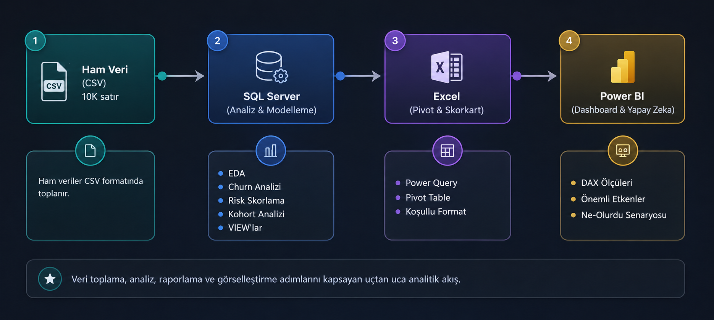
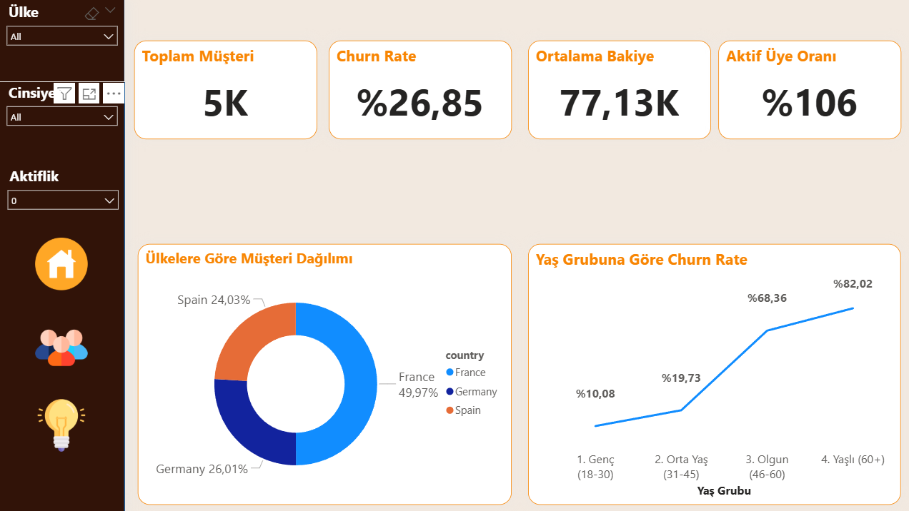
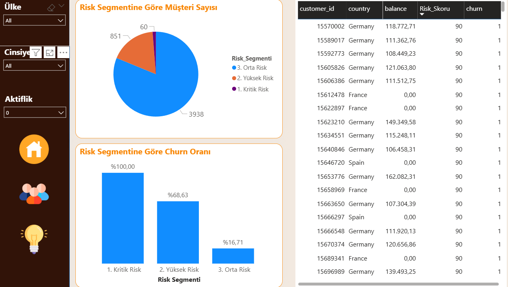
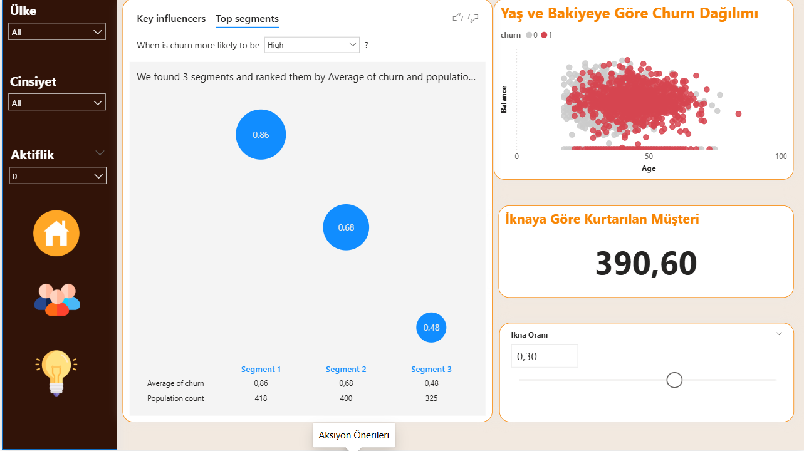

# 🏦 Bank Customer Churn Analysis — End-to-End BI Project

> 10.000 müşterinin verisini SQL ile analiz ettim, churn risk faktörlerini belirleyip ağırlıklı bir skorlama modeli kurdum. Sonuçları Power BI'da 3 sayfalık interaktif bir dashboard'a dönüştürdüm ve bulgularımı Power BI'ın makine öğrenmesi görseli ile çapraz doğruladım.


---

## 📋 İçindekiler

- [Proje Hakkında](#-proje-hakkında)
- [İş Problemi](#-iş-problemi)
- [Veri Seti](#-veri-seti)
- [Proje Mimarisi](#-proje-mimarisi)
- [SQL Analizi — Temel Bulgular](#-sql-analizi--temel-bulgular)
- [Risk Skorlama Modeli](#-risk-skorlama-modeli)
- [Power BI Dashboard](#-power-bi-dashboard)
- [Temel İçgörüler ve Aksiyon Önerileri](#-temel-içgörüler-ve-aksiyon-önerileri)
- [Kullanılan Araçlar ve Teknikler](#-kullanılan-araçlar-ve-teknikler)
- [Proje Yapısı](#-proje-yapısı)
- [Kurulum ve Kullanım](#-kurulum-ve-kullanım)

---

## 📌 Proje Hakkında

Bir bankanın 10.000 müşterisine ait demografik, finansal ve davranışsal verileri kullanarak müşteri kaybının (churn) arkasındaki nedenleri araştırdım. Sadece "ne olmuş" sorusuna değil, "neden olmuş" ve "ne yapmalıyız" sorularına da cevap veren bir analiz süreci kurguladım.

Projeyi baştan sona tek bir pipeline olarak tasarladım:

```
Ham Veri (CSV) → SQL Server (Analiz) → Excel (Hızlı EDA) → Power BI (Dashboard & Yapay Zeka)
```

---

## 🎯 İş Problemi

Bu projeyi, bir banka yöneticisinin masasına koyacağı 3 temel soruyu cevaplayacak şekilde kurguladım:

1. **"Müşterilerimizin %20'si neden gidiyor?"**
2. **"Önce kimi aramalıyız — en riskli segment hangisi?"**
3. **"Bir kampanya yapsak kaç kişiyi kurtarabiliriz?"**

---

## 📊 Veri Seti

**Kaynak:** [Kaggle — Bank Customer Churn Dataset](https://www.kaggle.com/datasets/radheshyamkollipara/bank-customer-churn)

| Özellik | Detay |
|---------|-------|
| Kayıt Sayısı | 10.000 müşteri |
| Sütun Sayısı | 12 |
| Hedef Değişken | `churn` (0 = Kaldı, 1 = Ayrıldı) |
| Ülkeler | Fransa, Almanya, İspanya |
| Null Değer | Yok ✅ |

**Sütunlar:** `customer_id`, `credit_score`, `country`, `gender`, `age`, `tenure`, `balance`, `products_number`, `credit_card`, `active_member`, `estimated_salary`, `churn`

---

## 🏗 Proje Mimarisi


---

## 🔍 SQL Analizi — Temel Bulgular

### EDA (Keşifsel Veri Analizi)

- Genel churn oranı: **%20.37**
- En kalabalık ülke: Fransa (%50), en düşük churn'e sahip
- Veri kalitesi temiz — NULL değer yok

### Segment Bazlı Churn Analizi

| Segment | Bulgular |
|---------|----------|
| **Cinsiyet** | Kadın müşterilerde churn oranı erkeklere göre daha yüksek |
| **Ülke** | Almanya en yüksek churn oranına sahip → Bölgesel hizmet sorunu sinyali |
| **Aktiflik** | Pasif üyelerde churn, aktif üyelere göre belirgin şekilde yüksek |
| **Ürün Sayısı** | 2 ürün "sweet spot" (%7.58 churn). 3+ ürün ise kritik risk: 4 ürün = **%100 churn** |

### Yaş Grubu Analizi (Data Binning)

Yaşları tek tek çizgi grafiğe dökmek yerine, küçük örneklem sapmasını (18 yaşında 3 müşteri varsa %66 churn çıkar gibi yanıltıcı oranları) engellemek için yaşları 4 iş grubuna böldüm:

| Yaş Grubu | Churn Oranı | Yorum |
|-----------|:-----------:|-------|
| 1. Genç (18–30) | %7.52 | Düşük risk |
| 2. Orta Yaş (31–45) | %15.74 | Orta risk |
| 3. Olgun (46–60) | **%51.12** | 🔴 **Kritik risk — Aksiyon gerekli** |
| 4. Yaşlı (60+) | %24.78 | Yüksek risk |

### Kohort Analizi (Tenure Bazlı)

- Yeni (0–3 yıl): %21.14 | Orta (4–6 yıl): %20.49 | Köklü (7–10 yıl): %19.51
- **Gruplar arası fark istatistiksel olarak anlamlı değil** → Churn, müşteri kıdemine bağlı değil

---

## 🎯 Risk Skorlama Modeli

### Ağırlık Tablosu

| Risk Faktörü | Puan | Gerekçe |
|--------------|:----:|---------|
| Yaş 46–60 arası | 30 | EDA'da en güçlü churn belirleyicisi |
| Aktif üye değil | 25 | Pasiflik, kopuş sinyali |
| 3+ ürün sahipliği | 25 | Zorunlu cross-sell şüphesi |
| Almanya'da yaşıyor | 10 | Bölgesel hizmet kalitesi sorunu |
| Sıfır bakiye | 10 | Hesabı fiilen kullanmıyor |

### Model Doğrulama — Sonuçlar

Modeli doğrulamak için segmentler arası churn oranına baktım — Kritik'ten Düşük'e doğru düzgün bir merdiven oluşması, skorlamanın tutarlı çalıştığını gösteriyor:

| Segment | Müşteri Sayısı | Churn Oranı | Aksiyon |
|---------|:--------------:|:-----------:|---------|
| 🔴 Kritik Risk | 60 | **%100** | Derhal müdahale — VIP müşteri tutma programı |
| 🟠 Yüksek Risk | 1.112 | **%65.92** | ← **Birincil aksiyon hedefi** |
| 🟡 Orta Risk | 4.630 | %18.98 | İzleme ve erken uyarı |
| 🟢 Düşük Risk | 4.198 | %8.69 | Standart hizmet |

> 💡 **Çapraz Doğrulama:** Power BI'ın "Önemli Etkenler" (Key Influencers) görseli de aynı faktörleri buldu — aktif olmayan, 46–65 yaş arası müşterilerde churn ihtimali **%74**. Yani el ile kurduğum skorlama modelini, makine öğrenmesi algoritması bağımsız olarak doğrulamış oldu.

---

## 📊 Power BI Dashboard

### Sayfa 1 — Executive Overview (Yönetici Özeti)



**İçerik:**

- 4 adet KPI Kartı: Toplam Müşteri, Churn Rate, Ortalama Bakiye, Aktif Üye Oranı
- Ülkelere Göre Müşteri Dağılımı (Donut Chart)
- Yaş Grubuna Göre Churn Rate (Çizgi Grafik)
- Interaktif Slicer'lar: Ülke, Cinsiyet, Aktiflik Durumu

---

### Sayfa 2 — Risk Segmentasyonu



**İçerik:**

- Risk Segmentine Göre Müşteri Sayısı (Pasta Grafik)
- Risk Segmentine Göre Churn Oranı (Sütun Grafik)
- En Riskli Müşterilerin Detay Tablosu (customer_id, country, balance, Risk_Skoru, churn)

---

### Sayfa 3 — Aksiyon Önerileri & Kök Neden Analizi



**İçerik:**

- **Önemli Etkenler (Key Influencers):** Power BI'ın makine öğrenmesi görseli — churn'ü etkileyen faktörleri otomatik tespit edip sıralıyor
- **Risk Matrisi (Dağılım Grafiği):** Her müşteri yaş ve bakiyesine göre bir nokta olarak çiziliyor. Kırmızı noktalar (terk edenler) hangi bölgede kümelenmiş, bir bakışta görülüyor
- **Ne-Olurdu Senaryosu (What-If):** Slider ile ikna oranını değiştirdiğinizde, bir müşteri tutma kampanyasının kaç müşteriyi kurtarabileceğini anlık olarak gösteriyor

---

## 💡 Temel İçgörüler ve Aksiyon Önerileri

| # | İçgörü | Aksiyon Önerisi |
|:-:|--------|-----------------|
| 1 | 46–60 yaş grubu **%51 churn** oranıyla en riskli segment | Bu segmente özel sadakat programı ve kişiselleştirilmiş iletişim |
| 2 | Pasif üyelerde churn oranı aktif üyelere göre çok yüksek | Pasif hesaplara otomatik aktivasyon kampanyaları (push bildirim, e-posta) |
| 3 | 3+ ürün sahipliği **%82+ churn** — Zorunlu cross-sell şüphesi | Ürün paketleme stratejisinin gözden geçirilmesi |
| 4 | Almanya operasyonlarında churn belirgin şekilde yüksek | Bölgesel müşteri memnuniyet araştırması ve hizmet kalitesi iyileştirmesi |
| 5 | Churn, müşteri kıdemine (tenure) bağlı **değil** | Müşteri tutma stratejileri tüm kıdem gruplarına eşit uygulanmalı |

---

## 🛠 Kullanılan Araçlar ve Teknikler

| Araç | Ne İçin Kullandım | Teknikler |
|------|-------------------|-----------|
| **SQL Server** | Veri analizi ve modelleme | `CTE`, `CASE WHEN`, `CAST`, `GROUP BY`, `HAVING`, `CREATE VIEW` |
| **Excel** | Hızlı ad-hoc analiz ve doğrulama | Power Query, Pivot Table, Koşullu Biçimlendirme |
| **Power BI** | İnteraktif dashboard ve yapay zeka analizi | DAX Ölçüleri, Hesaplanmış Sütunlar, Önemli Etkenler (AI), Ne-Olurdu Parametresi |
| **DAX** | Hesaplama katmanı | `CALCULATE`, `COUNTROWS`, `DIVIDE`, `SWITCH`, `IF` |

---

## 📁 Proje Yapısı

```
Bank-Customer-Churn-Analysis/
│
├── 📂 data/
│   └── bank_churn.csv                  # Ham veri seti (10K kayıt)
│
├── 📂 sql/
│   ├── 01_create_database.sql          # Veritabanı ve tablo oluşturma
│   ├── 02_load_data.sql                # CSV veri yükleme (BULK INSERT)
│   ├── 03_eda_queries.sql              # Keşifsel veri analizi (EDA)
│   ├── 04_churn_analysis.sql           # Segment bazlı churn analizi
│   ├── 05_age_analysis.sql             # Yaş grubu analizi (Data Binning)
│   ├── 06_risk_segmentation.sql        # Ağırlıklı risk skoru segmentasyonu
│   ├── 07_cohort_analysis.sql          # Kohort analizi (Tenure bazlı)
│   └── 08_views.sql                    # Raporlama VIEW'ları
│
├── 📂 excel/
│   └── churn_analizi.xlsx              # Pivot Table ve Skorkart
│
├── 📂 images/
│   ├── Executive_Summary.png           # Sayfa 1 ekran görüntüsü
│   ├── Risk_SegmantasYonu.png          # Sayfa 2 ekran görüntüsü
│   ├── Aksiyon_Önerileri.png           # Sayfa 3 ekran görüntüsü
│   └── Akış.png                        # Akış diyagramı
│
├── Churn_Report.pbix                   # Power BI Dashboard dosyası
└── README.md                           # ← Bu dosya
```

---
